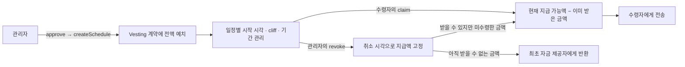

# Token Vesting

[](https://github.com/0Chord/vesting/actions/workflows/test.yml)


**정해진 시간에 따라 ERC-20 토큰을 나누어 지급하는 스마트컨트랙트입니다.**

토큰을 한 번에 전달하는 대신 계약에 예치하고, 수령자가 시간이 지난 만큼 청구하도록 구현했습니다. 일정이 중간에 취소되더라도 이미 받을 수 있게 된 금액과 반환할 금액을 구분합니다.

개인 학습 프로젝트로 계약과 테스트를 직접 작성했습니다. Solidity로 시간·권한·금액 처리 규칙을 표현하고, Foundry에서 시간을 바꿔 가며 경계 조건을 확인하는 데 집중했습니다.

[동작 예시](#동작-예시) · [설계와-구현](#설계와-구현) · [실행하기](#실행하기) · [테스트](#테스트) · [코드-안내](#코드-안내)

| 구분 | 내용 |
| --- | --- |
| 구현 기간 | 2026.08 — 계약 구현 및 단위 테스트 작성 |
| 사용 기술 | Solidity · Foundry · OpenZeppelin · GitHub Actions |
| 구현 범위 | 단일 ERC-20 토큰, 여러 지급 일정, 선형 지급, cliff, 청구, 취소·반환 |
| 현재 상태 | 계약·단위 테스트 구현. 배포 스크립트와 프런트엔드는 미포함 |

## 지급 흐름



계약 하나가 사용하는 토큰은 배포 시 정해지며 변경할 수 없습니다. 각 일정에는 수령자, 최초 자금 제공자, 총액, 누적 수령액, 시작 시각과 지급 기간을 따로 저장합니다.

## 동작 예시

설명을 위해 **1,000토큰 · 지급 기간 100일 · cliff 20일**인 일정을 가정합니다. 실제 체인에서는 초 단위의 `block.timestamp`와 토큰의 정수 최소 단위로 계산합니다.

| 시점과 행동 | 누적 지급 가능액 | 실제 이동 |
| --- | ---: | --- |
| 일정 생성 | 0 | 자금 제공자 → 계약: 1,000토큰 예치 |
| 시작 후 19일 | 0 | cliff 이전이므로 청구 불가 |
| 시작 후 20일 | 200 | 시작일부터 쌓인 금액을 청구할 수 있음 |
| 50일에 첫 청구 | 500 | 계약 → 수령자: 500토큰 |
| 75일에 관리자가 취소 | 750으로 고정 | 계약 → 최초 자금 제공자: 250토큰 반환 |
| 취소 후 수령자가 청구 | 750 | 이미 받은 500을 제외한 250토큰 지급 |

**cliff는 청구를 시작할 수 있는 시점입니다.** cliff부터 새로 금액을 쌓는 방식이 아니라, cliff에 도달하면 시작일부터 경과한 시간을 계산에 반영합니다. 다만 cliff 이전에 취소되면 지급 가능액은 0으로 고정되어 전액 반환됩니다.

취소하지 않고 종료 시점까지 진행하면 총액 전부가 지급 가능해집니다. 수령자는 이미 받은 금액을 제외한 나머지를 청구할 수 있습니다.

## 설계와 구현

### 1. 누적 지급액과 실제 청구액을 분리

`vestedAmount`는 이미 받은 금액까지 포함한 누적 지급 가능액이고, `releasableAmount`는 지금 추가로 청구할 수 있는 금액입니다.

```text
cliff 이전              : 지급 가능액 = 0
cliff 이후 ~ 종료 직전  : 지급 가능액 = floor(총액 × 경과 시간 / 전체 기간)
종료 시점 이후          : 지급 가능액 = 총액

추가 청구액 = 지급 가능액 − 누적 수령액
```

선형 계산에는 `Math.mulDiv`를 사용해 중간 곱셈의 오버플로를 피합니다. 종료 시점에는 총액을 반환하므로 정수 나눗셈으로 남은 금액도 마지막에 청구할 수 있습니다. 새로 받을 금액이 없으면 `NothingToClaim`으로 거절합니다.

구현: [`_vestedAmount`, `releasableAmount`, `claim`](src/Vesting.sol)

### 2. 토큰을 보내기 전에 권한과 상태부터 확인

일정 생성과 취소에는 `onlyOwner`를 적용했습니다. 청구는 해당 일정의 수령자만 할 수 있습니다.

`claim`은 호출자와 청구액을 확인한 뒤 **누적 수령액을 먼저 갱신하고 토큰을 전송**합니다. 외부 계약을 호출하기 전에 상태를 변경하는 Checks-Effects-Interactions 순서로 작성했으며, 생성·청구·취소에 `nonReentrant`를 적용했습니다. 토큰 전송은 `SafeERC20`으로 처리합니다.

구현: [`createSchedule`, `claim`, `revoke`](src/Vesting.sol)

### 3. 취소 이후에도 미수령분은 남김

취소 시 `revokedAt`을 기록하고, 이후 지급액 계산에는 현재 시각 대신 취소 시각을 상한으로 사용합니다. 시간이 더 지나도 지급 가능액은 늘어나지 않습니다.

반환액은 `총액 − 취소 시점의 지급 가능액`입니다. 이미 지급한 금액을 회수하지 않으며, 지급 가능하지만 아직 받지 않은 금액은 계약에 남겨 수령자가 청구하도록 했습니다. 반환 대상은 현재 관리자가 아닌 **일정을 만들 때 기록한 최초 자금 제공자**입니다.

구현: [`revoke`, `_vestedAmount`](src/Vesting.sol)

### 4. 약정한 금액이 실제로 들어왔는지 확인

일정 생성 전에 관리자가 계약에 토큰 사용을 승인해야 합니다. `createSchedule`은 전액을 전송받은 뒤 계약 잔고의 증가분이 요청한 금액과 일치하는지 확인합니다.

전송 수수료 등으로 실제 수령액이 다르면 `UnsupportedToken`으로 되돌립니다. 이 검사는 일정 생성 시의 입금액에 대한 검증이며, 모든 비표준 ERC-20 동작을 지원한다는 의미는 아닙니다.

구현: [`createSchedule`](src/Vesting.sol)

## 실행하기

[Foundry](https://getfoundry.sh/introduction/installation/)와 Git이 필요합니다. 의존성은 Git submodule에 지정된 커밋을 사용합니다.

```bash
git clone --recurse-submodules https://github.com/0Chord/vesting.git
cd vesting

forge build
forge test -vvv
```

이미 clone했다면 의존성을 먼저 가져옵니다.

```bash
git submodule update --init --recursive
```

테스트는 로컬 EVM에서 실행됩니다. RPC 주소, 지갑 개인 키, 실제 토큰이 필요하지 않습니다.

## 테스트

[`Vesting.t.sol`](test/Vesting.t.sol)에서 `vm.warp`로 시간을 이동하고, `vm.prank`로 호출자를 바꿔 계약 상태와 토큰 잔고를 확인합니다.

| 검증 대상 | 확인하는 동작 |
| --- | --- |
| 일정 생성 | 일정 저장, 전액 예치, 사용 승인 부족, 잘못된 수령자·금액·기간 거절 |
| 시간 경계 | cliff 직전과 정각, 기간 중간, 종료 직전·정각·이후의 지급액 |
| 청구 | 수령자 권한, 동일 시점의 반복 청구 거절, 새로 쌓인 금액만 지급, 종료 시 잔액 지급 |
| 취소 | 관리자 권한, 중복 취소 거절, 취소 시 지급액 고정, 미수령분 청구 |
| 청구와 취소의 조합 | 일부 수령 후 취소, cliff 전 전액 반환, 완전히 지급 가능해진 일정의 취소 거절 |

```bash
# CI와 같은 검사
forge fmt --check
forge build --sizes
forge test -vvv

# 청구 또는 취소 시나리오만 실행
forge test --match-test 'test_Claim_' -vvv
forge test --match-test 'test_Revoke_' -vvv
```

[GitHub Actions](.github/workflows/test.yml)에서 push와 PR마다 포맷·빌드·테스트를 실행합니다. 현재 테스트는 일반 ERC-20 mock을 사용한 시나리오 기반 단위 테스트입니다. 악성 토큰을 이용한 재진입 시나리오, 수령액 불일치 분기, fuzz·invariant 검증은 추가할 과제입니다.

## 코드 안내

```text
src/
└── Vesting.sol            # 일정 생성 · 지급액 계산 · 청구 · 취소

test/
├── Vesting.t.sol          # 시간 · 권한 · 금액 · 상태 전환 테스트
└── mocks/MockERC20.sol    # 테스트용 토큰

.github/workflows/test.yml # 포맷 · 빌드 · 테스트 CI
foundry.toml               # Foundry 프로젝트 설정
```

처음 읽는다면 [동작 테스트](test/Vesting.t.sol)에서 청구·취소 시나리오를 보고, [계약 코드](src/Vesting.sol)의 `claim` → `revoke` → `_vestedAmount` 순서로 확인할 수 있습니다.

<details>
<summary><strong>주요 함수와 호출 권한</strong></summary>

| 함수 | 호출 권한 | 역할 |
| --- | --- | --- |
| `createSchedule` | 관리자 | 전액 예치 후 새 일정 생성. `startTime = 0`이면 현재 시각 사용 |
| `claim` | 일정의 수령자 | 현재 청구 가능한 금액 전부 수령 |
| `revoke` | 관리자 | 지급액 고정 및 미확정 금액 반환 |
| `vestedAmount` | 누구나 | 누적 지급 가능액 조회 |
| `releasableAmount` | 누구나 | 지금 추가로 받을 금액 조회 |
| `getSchedule` | 누구나 | 일정별 상태 조회 |

</details>

## 다음 작업

시간·권한·잔고 관계에 대한 fuzz·invariant 테스트와 비표준 토큰 동작 검증을 보강하고, 로컬 배포·호출 예제를 추가할 예정입니다. 현재 저장소는 학습용 구현이며 외부 보안 감사를 받은 계약은 아닙니다.
